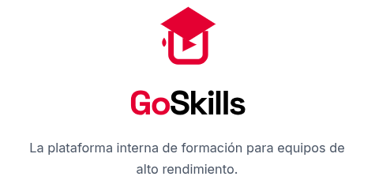
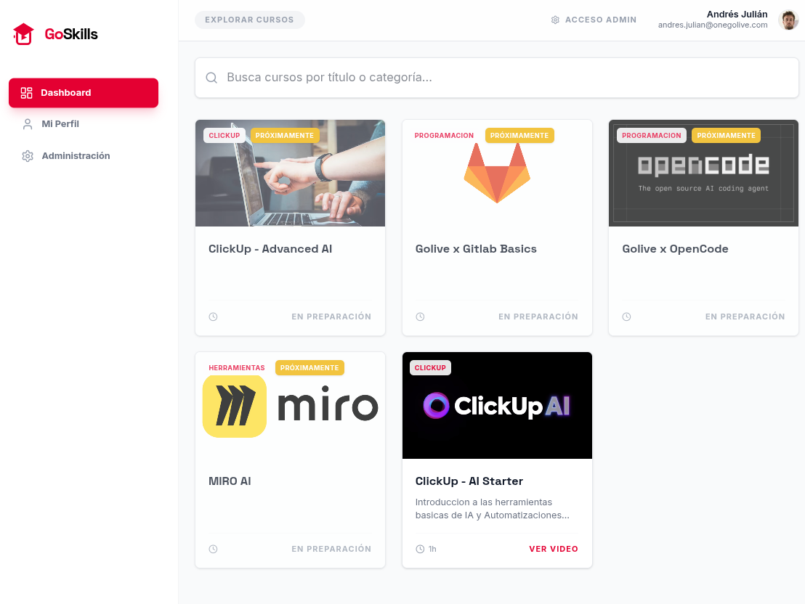

<div align="center">
  


</div>

GoSkills is a complete, modern Learning Management System (LMS) and video course platform. It is designed to provide users with a clean, intuitive dashboard to explore and consume video courses on various topics, such as AI tools and programming languages.

The platform includes a robust **Admin Panel** that allows administrators to:
- Create and categorize new courses.
- Manage course curriculums with multiple video chapters.
- Securely upload video files directly to **AWS S3**.
- Stream content securely using S3 Presigned URLs, protecting video assets from unauthorized direct access.

### Dashboard Overview


## Setup Instructions

### 1. Prerequisites
- Node.js installed.
- An AWS Account with an S3 bucket configured for CORS (to allow video uploads and playback).
- A Firebase project configured with Firestore and Authentication.

### 2. Required Secrets & Environment Variables
To run properly, the application requires several environment variables. These should be configured in your deployment environment (like the Secrets panel in AI Studio) or stored in a `.env` file for local development.

```env
# AWS Credentials for S3 Video Storage
AWS_ACCESS_KEY_ID="your_aws_access_key"
AWS_SECRET_ACCESS_KEY="your_aws_secret_key"
AWS_REGION="your_aws_region"
AWS_S3_BUCKET="your_bucket_name"

# Admin Panel Access Password
ADMIN_ACCESS="your_secure_password"

# Restrict Access to specific Email Domains (Comma-separated)
ALLOW_DOMAINS="gmail.com,yourcompany.com"
```

### 3. AWS S3 CORS Configuration
To allow the platform to upload and read videos from your AWS S3 bucket, ensure your bucket's CORS (Cross-Origin Resource Sharing) policy is configured exactly as follows:

```json
[
  {
    "AllowedHeaders": ["*"],
    "AllowedMethods": ["PUT", "POST", "GET"],
    "AllowedOrigins": ["*"],
    "ExposeHeaders": []
  }
]
```

### 4. Running the Project
This project uses Vite and a Node.js Express server to handle API routes like the AWS S3 interactions.

1. **Install Dependencies:**
   ```bash
   npm install
   ```

2. **Start the server:**
   ```bash
   npm run dev
   ```
   *The server runs on port 3000.*

3. **Production Build:**
   ```bash
   npm run build
   npm run start
   ```

## Key Technologies
- **Frontend:** React, Tailwind CSS, Lucide Icons
- **Backend Setup:** Node.js, Express, Vite
- **Storage:** AWS S3 (Integration via `@aws-sdk/client-s3` and `@aws-sdk/s3-request-presigner`)
- **Database & Identity:** Firebase (Firestore & Auth)
